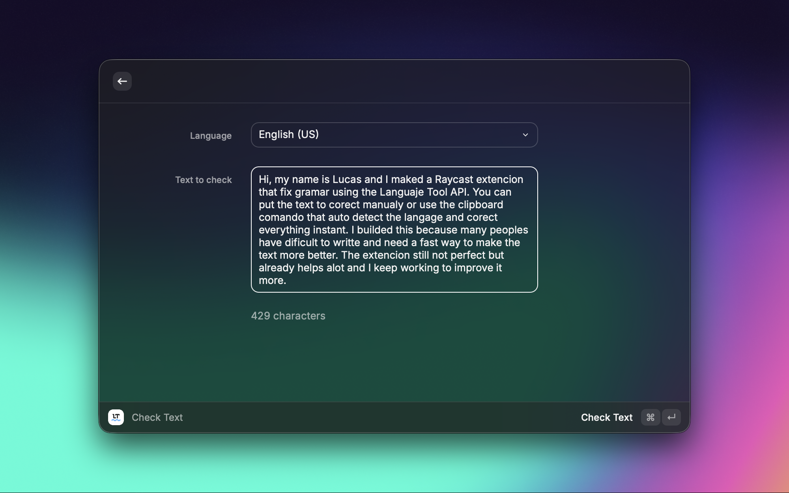
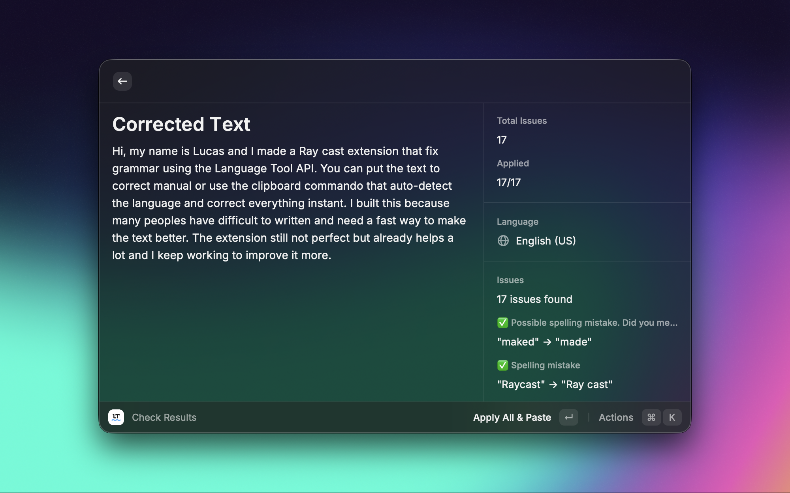
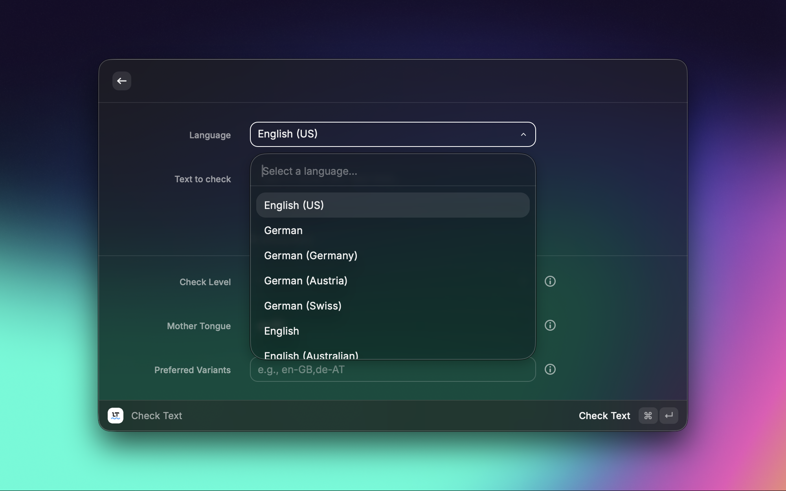

# LanguageTool for Raycast ✨

> Instant spelling and grammar correction using LanguageTool API. Get real-time suggestions and improve your text quality in multiple languages.

## 👨‍💻 Developer

This extension was **developed and created by [lucastaonline](https://github.com/lucastaonline)**.

After successful development and contributions, the extension has been merged into the official Raycast Extensions repository, where it continues to be maintained and improved.

**Original Developer:** [@lucastaonline](https://github.com/lucastaonline)

---

## 📍 Code Location

This extension has been merged into the official Raycast Extensions repository.

**All code and documentation are now available at:**

👉 **[https://github.com/raycast/extensions/tree/main/extensions/language-tool](https://github.com/raycast/extensions/tree/main/extensions/language-tool)**

---

## 🚀 Installation

Install directly from the Raycast Store:

1. Open Raycast
2. Search for "Store"
3. Find "LanguageTool"
4. Click "Install"

---

## 📸 Screenshots

  
  
  
  

---

Made with ❤️ by [lucastaonline](https://github.com/lucastaonline)
